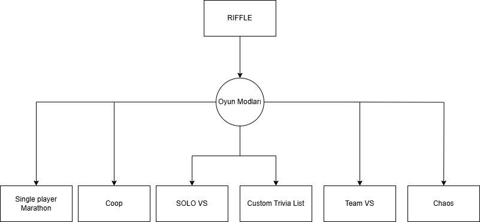

# 🎸 Riffle

> A Rock & Metal music trivia game built with **HTML**, **JavaScript**, **Tailwind CSS**, and the **Spotify API**.

<p align="center">
  
</p>

---

## 🚀 Features

- 🎶 Real-time trivia questions based on Deezer data
- 🧠 Multiple difficulty levels and game modes
- 🎨 Responsive design with Tailwind CSS
- 📊 Score tracking and session-based history

## 🛠️ Technologies Used

- HTML5
- JavaScript (Vanilla)
- Tailwind CSS
- Deezer API

## Installation

```
git clone https://github.com/kullanici-adi/riffle.git
cd riffle
npm install
npm start
```
